# Public Project

## Executive Summary

Using a seminal study on wine from the Vinho Verde region of Portugal, this project looked to create a predictive model capable of classifying wine quality based on physiochemical properties, to help stakeholders identify key quality factors in wine. 

A logistic regression model was selected as the baseline algorithm, as a test of the linear relationship between the features and wine quality. 

The model demonstrated decent recall for high and low quality wines (0.6 and 0.73) but poor precision, indicating a high rate of false positives, medium quality wines incorrectly being flagged as high quality.

Future iterations could look to use a more advanced model, such as XGBoost to hyper define the parameters, or improve the binning strategy by expanding the options or including the original score boundaries. 

## Data Infrastructure & Tools

The project was developed using cloud-compatible data science tools, that would ensure scalability and reproducibility, which should help to improve both the reliability and the interpretability of the models. These tools included, Google Colab, chosen for its access to GPU and the cost, as little money was available to execute the project, and Colab grants easy access to every user, simply needing a Google account. Alternatives such as Deepnote could have been utilised, but the familiarity and accessibility of Colab made it the ideal choice. Future iterations of this project could look to move the notebooks into a wider ecosphere such as Azure/Fabric to automate ingestion and engineering, and google colab would easily allow this.

The choice of libraries to use within colab was driven by ease-of-use and scalability, and so Scikit-learn was chosen as the main library to allow for algorithmic modelling, namely logistic regression, alongside seaborn for visualization. In future, within Azure, these libraries could be dropped in favour of native PowerBI visualisations, which would allow for more interactivity. Further, and if money was less of an object, some AI tools that help with simple natural language processing to autogenerate more interesting and interpretable visuals, such as CoPilot or Julius AI.3

Finally, the dataset itself was sourced from Kaggle (Kaggle, n.d.), where users have merged the seminal UCI study (Cortez, 2009), a data set of white and red wines from the Vinho Verde area of Portugal. The benefits of using a public dataset from Kaggle include the ability to utilise the API function to automate ingestion, and avoidance and cost of licensing the dataset, or ethical issues of scraping a dataset from the internet, such as introducing bias, legal ambiguity of ownership of data and potential privacy violations. 

## Data Engineering

A pipeline was initialised in Colab using the Kaggle API to ensure the dataset remained up-to-date on each run. Standard libraries were loaded for analysis. The API approach future-proofs the ingestion, howver there is a risk of the publicly sourced dataset being moved or decommissioned. 

### Fig 1: Libraries Loaded

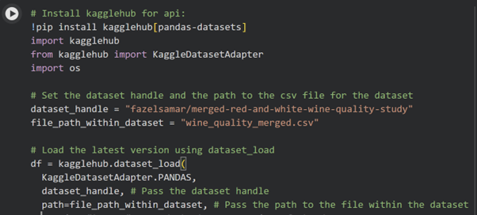
### Fig 2: API pathway loaded for easy ingestion

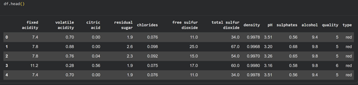
### Fig 3: Dataset head

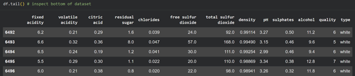
### Fig 4: Dataset tail

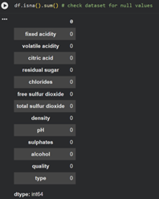
### Fig 5: Table showing no null values found

Exploratory data analysis (EDA) confirmed the dataset contained no null values, and thus no imputation was required. Furthermore, the distribution of the dataset was visualised to identify the spread of data.

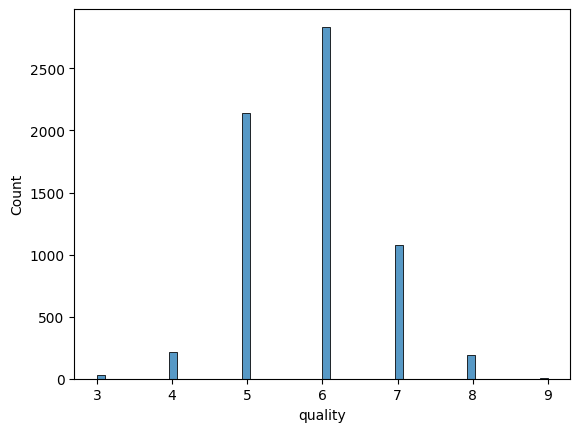
### Fig 6: Distribution of the wine scores across the dataset

To simplify, the target variable and to mitigate noise from rare classes, the quality scores were grouped into bins, with rationale and created function as seen below. This generalisation should help to aid understanding, with bin thresholds chosen carefully as to avoid introducing bias.

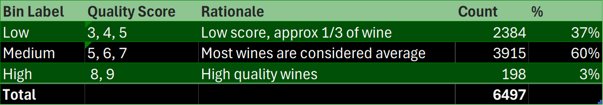
### Fig 7: Bin label justification

### Fig 8: Bin function created in python

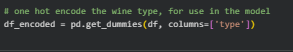
### Fig 9: One Hot Encoding function in python, using pandas.

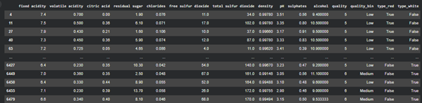
### Fig 10: Table showing the one hot encoded dataset

Furthermore, the “wine type” column was on-hot encoded to convert text labels into a machine readable format.

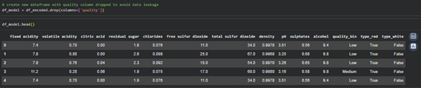
### Fig 11: Table showing final dataset for model

## Data Visualisation & Dashboards 

Matplotlib was used to visualize the quality bin distribution, with red and white colours used to aid distinction.

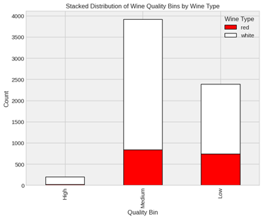
### Fig 12: Stacked bar chart in red and white indicating quality of wines and wine type

The data shows a split in quality across wine types, though high-quality red wines are scarce, a limitation that should be factored into the model. This quality split is borne out in reality though (GRTWines, 2024) and so perhaps a slightly fairer categorisation for the binning would be average, good and very good, with good replacing medium in the bin naming in future. 

### Fig 13: Correlation heatmap of physiochemical properties

A correlation heatmap was generated, identifying collinearity, with colours chosedn for maximum visual impact. A strong positive correlation exists between free and total sulfur dioxide, although again this a known quality of wines (Pablo Giménez-Gómez, 2017), and it was decided to leave both in, but note the likely collinearity. Other positive indicators are also well known domain-valid relationships (residual sugar and density).

Conversely,  alcohol and density at -0.69 suggests that this relationship will be a powerful predictor of wine quality as the accepted understanding is that the higher the  alcohol, the lower the density, seen from the below boxplots and scatter graph: 

### Fig 14: Boxchart showing the correlation between high alcohol and quality, coupled with wine types

### Fig 15: Scatterplot showing the downward trend between alcohol and density

Boxplots and scatter graphs confirm that lower density correlates with higher alcohol content and higher quality scores. While these static visuals highlight key trends, future iterations would benefit from interactive dashboards, allowing stakeholders to explore these physicochemical relationships in greater detail. Interactive dashboard products and AI models online such as Akkio (Top AI Tools, 2025), or enabling co-pilot in BI could help in this regard. 

## Data Analytics

As the central hypothesis for this project is that wine quality can be predicted from physiochemical properties found within the wine, such as alcohol, density, acidity and sulfates, a logistic regression model was chosen. Logistic regression is a supervised classification model, and is highly interpretable, transparent and aligns with ethical requirements of replicability. Other models that could also work were considered, such as random forest or tree classification, but ultimately we rejected due to the slightly more complex nature. 

The data were split into train test models, with the target variable “quality bins” split out and the remaining features, aside from the one hot encoded wine type, scaled as they were all on different scales, and the results of using unscaled features could be convergence or undue weight to features on a larger scale (e.g alcohol by volume on a 9-15 scale versus density on a decimalised scale. Due to the low count of high quality wines, it was decided that SMOTE would be utilised to ensure the dataset was more balanced, and would be able to identify high quality wines. There is a distinct trade off here though, as SMOTE also tends to stretch the decision boundaries to accommodate the lower represented class. 

SMOTE also does not balance the inflated sample size with anything other than the target variable, so the number of synthetic wines included in the dataset can swing more towards the dominant class, in this case white.  However, for this data model, these risks were considered and it was decided to still proceed with SMOTE. Future iterations could look at different approaches, such as using a different model, or combining SMOTE with a balance across the classes. 

### Fig 16: image showing scaled train model with the SMOTYE balance applied

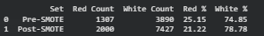
### Fig 17: Post SMOTE impact on wine type imbalance

After running the model, the results are mixed. 

### Fig 18: Classification table for the model

High quality wines have low precision, (0.08) but a decent recall (0.6), meaning that the model is identifying high quality wines correctly, but is also incorrectly identifying wines as high quality when they are not. Paired with the low recall on medium wines, its likely medium quality wines are being incorrectly identified as high quality, likely due to the noise between the boundaries of mid and high quality wine. Low quality wines are predicted with a decent balance. 

### Fig 19: Confusion matrix for the model

The confusion between classes in the model are clearly shown in the matrix, especially in medium wines, where only 330 were correctly predicted versus 453 misclassified, split across both boundaries. High quality and low quality wines show better degrees of accuracy in correct predictions, but are still low due to the medium misclassifications.

### Fig 20: Coefficient impact on quality

Despite the predictions of the model, there are still clear indicators of the features driving wine quality, with residual sugar, alcohol and fixed acidity the strongest positive drivers. A one unit increase in residual sugar for instance multiplies the odds of high quality by 2.58, given the log odds calculation. 

In the retrospect, density and Volatile acidity have a negative impact on quality, with a one unit increase in density decreasing the quality odds by a multiple of 0.39, a quite sharp drop. 

Overall, given some improvements and perhaps a change of model to XGBoost, robust to outliers and any collinearity and allowing for hyper parameter tuning, this dataset could be used to help wine makers understand the likelihood of the wine quality of their grapes, given the physiochemical properties. 

